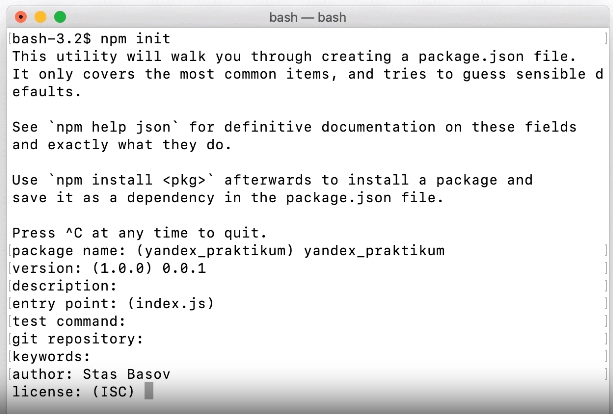
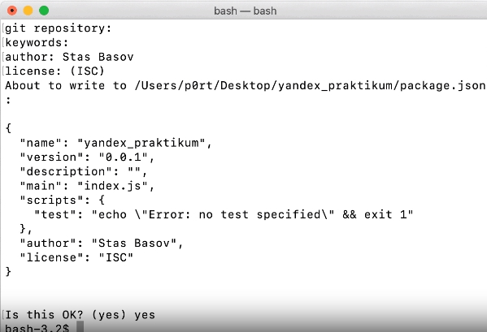
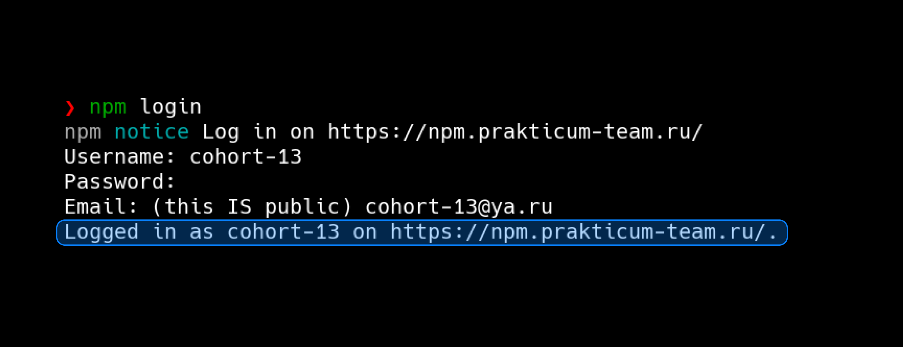
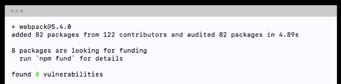
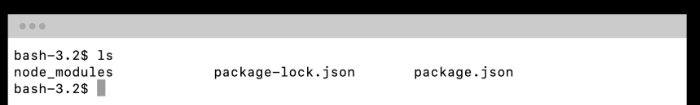
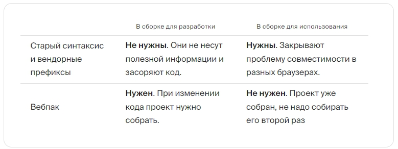
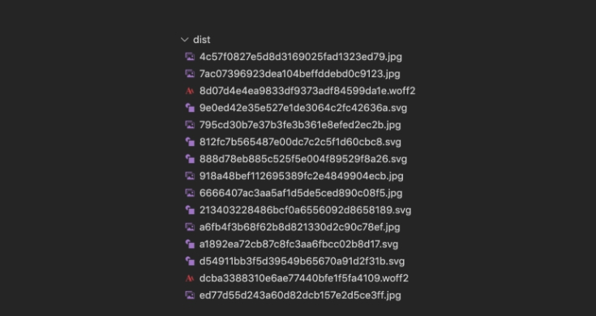

[Главная](README.md)

# Webpack

+ [Что такое сборка?](#Что-такое-сборка)
+ [Библиотека пакетов NPM](#Библиотека-пакетов-NPM)
+ [Как установить NPM](#Как-установить-NPM)
+ [Как пользоваться NPM](#Как-пользоваться-NPM)
+ [Подключаем репозиторий NPM пакетов от Практикума](#Подключаем-репозиторий-NPM-пакетов-от-Практикума)
+ [Настройка npm](#Настройка-npm)
+ [Устанавливаем Webpack](#Устанавливаем-Webpack)
+ [Настраиваем сборку](#Настраиваем-сборку)
+ [Настроим Webpack](#Настроим-Webpack)
+ [Транспиляция JS ставим Babel](#Транспиляция-JS-ставим-Babel)
+ [Настраиваем обработку HTML](#Настраиваем-обработку-HTML)
+ [Настраиваем обработку изображений и шрифтов](#Настраиваем-обработку-изображений-и-шрифтов)
+[Настраиваем обработку CSS](#Настраиваем-обработку-CSS)
+ [Минификация CSS и добавление префиксов](#Минификация-CSS-и-добавление-префиксов)


##  Что такое сборка?

__Сборка кода__ — превращение отдельных файлов в один. Все файлы на JS преобразуют в единый JS-файл, а файлы на CSS — в единый CSS-файл. 

Полученные файлы подключают в HTML. При этом код преобразуется:

+ JavaScript-код, написанный по новой спецификации, переделывается в точно такой же, но написанный по старой. Это позволяет пользоваться всеми самыми современными инструментами языка и не беспокоиться о поддержке сайта старыми браузерами.

+ JavaScript и CSS минифицируются. Это значит, что внутри файла удаляются все пробелы, переносы строк и комментарии: браузеру они не нужны, а файл с кодом становится короче и оттого — легче. Более лёгкий файл быстрее загрузится.

+ Вендорные префиксы тоже проставляются автоматически. Так что за поддержку css-кода старыми браузерами тоже можно не волноваться.

Сборку выполняют специальные программы-сборщики. Их несколько, например, `Parcel`, `Rollup` и `Webpack`. Последний, «Вебпак», — самый популярный и гибкий инструмент, а потому и самый универсальный. Поэтому изучать мы будем его. Если в будущем вам понадобятся знания других сборщиков, вы без труда их освоите, обладая навыками настройки «Вебпака».

[В главное меню](#Webpack)


## Библиотека пакетов NPM

Программисты постоянно придумывают новые инструменты для разработки. Когда новый инструмент готов, им как-то нужно поделиться с другими разработчиками. Самый простой способ — выложить свой код на сервере и дать людям возможность к нему обращаться. 
Так раньше и делали.

Например, подключение к проекту библиотеки jQuery выглядело так:

```html
<script src="https://code.jquery.com/jquery-3.3.1.min.js"></script> 
```

Такой подход чреват сложностями. Например, если вы захотите использовать более новую версию jQuery, придётся зайти на официальный сайт и найти ссылку на последнюю версию. После чего прописать её в своём проекте. При этом вам могут быть нужны 15 библиотек. Ходить копировать ссылки на 15 сайтов долго и мучительно.

Поэтому разработчики решили складывать все удобные инструменты в одно место — библиотеку утилит. Она называется NPM.

NPM создавалась разработчиками Node.js. Отсюда и название: раньше NPM позволял работать только с утилитами Node.js.

Теперь NPM стал библиотекой для любых программ для веб-разработки, в том числе и «Вебпака».

[В главное меню](#Webpack)


## Как установить NPM

Поскольку NPM был придуман создателями Node.js, чтобы получить доступ к NPM-утилитам, Node.js нужно установить. 

Скачайте её с [официального сайта](https://nodejs.org/en/download "Node.js") выбрав версию своей OC и поставьте на компьютер.

Затем проверьте, что всё установилось правильно. Для этого введите в терминале команду:

```bash
# проверим версию Node.js в Bash
node -v
# на этапе написания курса версия такая, она может отличаться от вашей
v12.16.3 
```

Раз Node.js установлена, то и NPM должен быть на месте. Проверить это можно так:

```bash
npm -v
# У вас появится такая же или более поздняя версия
6.11.3
```

[В главное меню](#Webpack)


## Как пользоваться NPM

После установки NPM на вашем компьютере появились утилиты, которые умеют устанавливать библиотеки и инструменты в проект. Но этим утилитам нужно знать, какие именно инструменты вам нужны.

Список нужных инструментов прописывают в файле package.json. У него есть строгие правила оформления. Чтобы о них не думать, можно создать package.json автоматически:

```bash
npm init # в папке с проектом
```
После этой команды терминал начнёт задавать вам вопросы о проекте. Вот их список, а также список наших ответов:




В результате получим вот такой файл package.json:

```json
{
  "name": "yandex.praktikum",
  "version": "0.0.1",
  "description": "Learning platform",
  "main": "index.js",
  "scripts": {
    "test": "echo \"Error: no test specified\" && exit 1"
  },
  "author": "Stas Basov",
  "license": ""
}
```

Если не захотите — можете не отвечать на все эти вопросы. Просто ничего не вводите и жмите Enter. Или сразу запустите команду вот так:

```bash
npm init --yes
```

Теперь, если вы зачем-то захотите добавить в проект библиотеку jQuery, сделаете это просто командой в терминале:

```bash
# При этом нужно находиться в папке проекта
npm install jquery
```

>Библиотека NPM очень популярна среди разработчиков. Идея единого хранилища, куда может прийти любой разработчик и получить нужный пакет — хороша, но не лишена изъянов. Основные проблемы: стабильность и безопасность. Установка нестабильного и небезопасного пакета может привести к последствиям, к примеру некорректной работе продукта и потере данных. Чтобы этого избежать, в крупных компаниях создают собственные хранилища пакетов (англ. “registry”), куда помещают только проверенные пакеты. В следующем уроке расскажем, как установить репозиторий от Практикума.

[В главное меню](#Webpack)


## Подключаем репозиторий NPM пакетов от Практикума

Во время обучения студенты нередко сталкиваются с тем, что npm пакеты бывают недоступны, содержат вредоносный код или зависимости долго загружаются. Чтобы избежать эти проблемы, мы развернули собственный npm репозиторий.

В нём размещены все необходимые в процессе обучения пакеты и зафиксированы их версии, что минимизирует риск получить пакет с вредоносным кодом. В этом уроке вы узнаете, как это сделать.

### Перед тем как начать

Чтобы установить и использовать npm репозиторий, нужно убедиться, что у вас установлена: 
+ актуальная версия `Node.js (старше 16.14.0).`

Чтобы проверить версию, выполните в терминале команду `node -v.`

Если установленная версия Node.js ниже рекомендуемой, установите актуальную с [официального сайта](https://nodejs.org/en/download "Node.js")

+ актуальная версия пакетного менеджера npm (старше 8.5.4).

Чтобы проверить версию, выполните в терминале команду `npm -v`. 

Если установленная версия npm ниже рекомендуемой, обновите её до актуальной при помощью команды:

```bash
npm upgrade -g npm
```

[В главное меню](#Webpack)


## Настройка npm

После того, как вы убедитесь, что Node.js и пакетный менеджер обновлены до актуальной версии, можно приступить к настройке менеджера npm. Для этого нужно пройти по шагам:

+ установить репозиторий Яндекс.Практикума в качестве источника пакетов по умолчанию. Для этого в терминале выполните следующую команду:

```bash
npm set registry https://npm.prakticum-team.ru
```

+ авторизоваться с логином и паролем, который вам выдал куратор. По умолчанию логин — имя когорты, а email —<имя_когорты>@ya.ru.

```bash
npm login
```
В случае успеха в терминале будет выведено:

```bash
Logged in as <имя когорты> on https://npm.prakticum-team.ru/
```



Но в последних версиях npm изменили алгоритм авторизации по умолчанию, поэтому у вас может возникнуть ошибка:

```bash
"Web login not supported"
```

В случае ошибки выполните команду с флагом `--auth-type=legacy:`

```bash
npm login --auth-type=legacy
```

После этого вы можете использовать пакетный менеджер привычным образом.

### Переключение на стандартный репозиторий

Когда вы закончите обучение или если у вас возникнут сложности с установкой пакетов, к примеру, потребуется установить версии пакетов, которые отсутствуют в репозитории Практикума, рекомендуем переключиться на основной репозиторий. 

Для этого нужно выполнить команду в терминале:

```bash
npm set registry https://registry.npmjs.org/
```

В следующем уроке расскажем, как установить «Вебпак» в свой проект. Теперь это возможно, потому что установлен NPM — он позволяет добавлять утилиты для работы с проектом.

[В главное меню](#Webpack)


## Устанавливаем Webpack

### Следуйте инструкции

1. Создайте папку для своего проекта. Назовите её `praktikum`.
1. Зайдите в эту папку в терминале и введите `npm init`, чтобы создать `package.json`.
1. Введите команду `npm i webpack --save-dev`.

>«Вебпак» установлен. Вы великолепны.

### Осознайте инструкцию

Команда для установки «Вебпака» состоит из 4 частей:
+ `npm` — так начинаются все команды NPM. Терминал благодаря этому понимает, что команду нужно брать именно из этого пакетного менеджера;
+ `i` — означает install, «установить». Мы будем пользоваться этой командой всякий раз при установке пакетов;
+ `webpack` — имя пакета, которое мы хотим установить;
+ `--save-dev` — это флаг. Для чего он нужен на пальцах не объяснишь. Сейчас разберёмся.

После установки терминал покажет отчёт о проделанной работе:



>Терминал показывает, что «Вебпак» установлен

При этом в нашей папке появилась папка `node_modules` и 2 файла: `package.json` и `package-lock.json`. Убедитесь в этом командой `ls`:



>Папка и оба файла на месте

Все пакеты для разработки можно разделить на два типа: те, что нужны в финальной сборке, этот код загрузится к клиенту на компьютер, и те, что нужны при разработке проекта. Например, библиотека jQuery нужна в сборке — браузер будет брать имена функций и методов из неё.

«Вебпак» же относится к пакетам, которые в сборке не нужны. Он делает всю свою работу в процессе разработки, и загружать его каждому пользователю вместе с сайтом не нужно.
Чтобы разделить эти два типа пакетов, в файле `package.json` есть разделы: `dependencies` и `devDependencies`:

```json
{
  "name": "yandex.praktikum",
  "version": "0.0.1",
  "description": "Learning platform",
  "main": "index.js",
  "scripts": {
    "test": "echo \"Error: no test specified\" && exit 1"
  },
  "author": "Stas Basov",
  "license": "",
  "dependencies": {
    // здесь будут зависимости
  },
  "devDependencies": {
    // а здесь зависимости для разработки
  }
}
```

Все пакеты из первого раздела попадают в финальную сборку, а из второго — нет.
Терминалу нужно объяснить, в какой раздел package.json ему следует записать «Вебпак». Именно для этого и нужен флаг `--save-dev`. С ним пакет будет добавлен в раздел devDependencies и в финальную сборку не попадёт.

### Установите интерфейс

`«Вебпак»` у вас уже есть — тут мы не обманули. Но «Вебпак» ещё нужно настроить. Для этого у него есть свой файл конфигурации. Внутри этого файла есть куча параметров, которые определяют, как именно ваш проект нужно собирать.
Чтобы взаимодействовать с этими параметрами прямо из терминала, изобрели интерфейс — `webpack CLI`. Установим его, а про настройку «Вебпака» расскажем позже.

Введите команду `npm i webpack-cli --save-dev`. Она имеет ту же структуру, что и команда для установки «Вебпака». Только имя самого пакета отличается.

### А вот теперь всё
>Вы установили «Вебпак» и интерфейс для его настройки. Это два пакета, которые теперь записаны в файл package.json вашего проекта. Вы записали их в раздел devDependencies, чтобы не включать в финальную сборку.
Когда вы устанавливаете пакеты, они попадают в папку node_modules. Она появится в папке с проектом автоматически, после установки первого пакета.

[В главное меню](#Webpack)


## Настраиваем сборку

Во втором уроке мы говорили, что сборка — процесс превращения множества ваших файлов с кодом в один большой. У одного проекта может быть несколько сборок, по одной под каждую цель.

Обычно в проекте есть две сборки: одна для разработки, другая для конечного пользователя. Разработка и использование — разные процессы, поэтому и требования к сборкам разные:



«Вебпаку» нужно как-то объяснить, что в какую сборку включать, какие утилиты запускать и что делать с кодом. Для всего этого есть специальные разделы внутри файла package.json. В уроке расскажем как раз об этих разделах, и как ими пользоваться.

### Выбираем вид сборки. Раздел scripts

Сборка кода осуществляется последовательностью команд. Каждая команда определяет действие: скопировать строки кода, удалить пробелы, добавить префиксы. Получается длинная инструкция: какие файлы нужны, что с ними делать и куда в итоге всё складывать.

Сама логика каждой команды уже прописана под капотом у «Вебпака». Нам лишь нужно организовать их в правильную последовательность — скрипт. Такие скрипты прописывают в разделе scripts файла package.json. «Из коробки» этот раздел выглядит так:

```json
"scripts": {
  "test": "echo \"Error: no test specified\" && exit 1",
}
```

Любой скрипт запускается командой npm run имя скрипта. В нашем файле `package.json` пока только один скрипт, он называется `test`. Запустим его:

```bash
npm run test
# Появится сообщение об ошибке
```

Нам такой скрипт не нужен — удалим его. И вместо него напишем скрипт для сборки проекта:

```json
"scripts": {
  "build": "webpack"
}
```

Теперь у нас есть скрипт `build`. В него мы записали команду `webpack`. Так мы скомандовали `Node.js` найти в папке `node_modules` модуль `webpack` и запустить его.

### Определяем точку входа

При модульном подходе у вас в проекте находится множество файлов. Одни файлы подключают к другим директивой `import`.
Во время сборки «Вебпак» заходит в файл и добавляет его код в итоговый код. Затем повторяет ту же операцию для каждого подключённого через `import` файла. Так «Вебпак» собирает код всех файлов в один большой.

Но «Вебпаку» нужно как-то понять, куда идти в первую очередь, — точку входа. По умолчанию точка входа — файл `index.js` внутри папки `src`. Поэтому создайте в папке своего проекта директорию `src`, а в ней — файл `index.js`.
Теперь всё готово к сборке. Запустите её командой `npm run build`.

В папке вашего проекта появится директория `dist`, а внутри неё — файл `main.js`. В этот файл будет приходить весь js-код вашего проекта (уже очень скоро).

### Каждый раз новая сборка

В течение этой темы вы настроите «Вебпак» так, что в папку `dist` будут попадать все файлы проекта: `html, css, js, картинки, шрифты`. В процессе разработки проекта в нём могут появляться новые файлы, а старые, наоборот, удаляться.
Чтобы в папке `dist` не скапливались файлы, её лучше очищать перед каждой сборкой. Самый простой способ сделать это — добавить в скрипт `build` удаление папки `dist` перед сборкой.

>Если у вас Windows. Для этого допишите `rd /s /q dist && `в build-скрипте:

```json
"scripts": {
  "build": "rd /s /q dist && webpack", // добавили удаление папки
}
```

>Если у вас macOS. Для этого допишите `rm -rf dist &&` в build-скрипте:

```json
"scripts": {
  "build": "rm -rf dist && webpack", // добавили удаление папки
}
```

Теперь перед каждой сборкой папка dist будет удаляться, а в сборку будут попадать только самые свежие файлы.

Кроссплатформенное решение. В конечном счёте разработчики используют разные ОС, поэтому круто найти возможность выполнять скрипт на любой ОС. Такое решение есть и мы расскажем про него через несколько уроков. А пока — про локальный сервер.

```json
"scripts": {
  "build": "rimraf dist && webpack" // добавили удаление папки
}
```

### Настраиваем локальный сервер

Директивы `import` и `export` не работают без сервера — такова их внутренняя логика. Поэтому без сервера невозможно проверить, как работает модульный код.

На помощь приходит локальный сервер. Это настоящий сервер у вас на компьютере, но подключиться к нему можете только вы. Для разработки как раз то, что нужно.

Устанавливаете локальный сервер → получаете все серверные возможности, в том числе и работу модулей.

В проектной работе прошлого спринта вы установили локальный сервер как расширение в текстовый редактор. А сейчас установим локальный сервер как зависимость в проект. Такой локальный сервер интегрирован с «Вебпаком»: это упростит разработку.

Локальный сервер — тоже утилита. Её можно получить из NPM командой `npm i webpack-dev-server --save-dev`. Выполните эту команду, и утилита добавится в `devDependencies` файла `package.json` . Локальный сервер ещё предстоит настроить, но подготовка проведена.

### Создаём вторую сборку

Одной сборки недостаточно. Мы не можем добавлять локальный сервер в финальную сборку — он нужен только при разработке. Но и без локального сервера нам не обойтись.
Всё, что остаётся, — создать отдельную сборку для разработки. Для этого пропишем её в разделе `scripts` файла `package.json`:

```json
"scripts": {
  "build": "rm -rf dist && webpack",
  "dev": "webpack serve"
}
```

Теперь нам доступен ещё один скрипт — `npm run dev`. Команда `webpack serve` запустит проект на локальном сервере.
В следующем уроке мы добавим в эту сборку дополнительные инструменты, полезные только для разработки проекта, поэтому укажем явно, что первая сборка для финальной подготовки файлов к публикации:

```json
"scripts": {
  "build": "rm -rf dist && webpack --mode production",
  "dev": "webpack serve"
}
```

### Собираем проект

Вызовите из терминала команду `npm run dev`. Откроется ваш проект на локальном сервере — по адресу `localhost:8080`. Пока проект пустой, вы видите интерфейс для просмотра файлов на сервере, то есть файлов вашего проекта.

Обратите внимание: пока сервер работает, новых команд в Git bash создать не получится. Выхода два:

1. Завершить выполнение локального сервера. Для этого нажмите Ctrl + C. Если вы работаете в Git Bash для Windows, это единственный способ продолжить работу с терминалом.

1. В терминале для macOS и Linux есть вкладки — прямо как в браузере. Вы можете открыть несколько вкладок, и работа в каждой из них не будет влиять на работу других. Чтобы создать новую вкладку, нажмите Cmd + T (macOS) или Ctrl +Shift + T (Linux).

>Теперь окружение настроено: две отдельные сборки для разработки и для финальной версии продукта. Кроме того, теперь у нас есть локальный сервер, а вместе с ним и модули JS.
Всё это время мы устанавливали пакеты. В следующем уроке перейдём к их настройке.

### Задание

1. Запустите сборку командой `npm run dev`
1. Перейдите по адресу http://localhost:8080 в вашем браузере, и вы увидите ошибку загрузки страницы: “Cannot GET /”. Это нормально, страницу мы сделаем позже.

[В главное меню](#Webpack)


## Настроим Webpack

До этого мы устанавливали пакеты: «Вебпак» и локальный сервер. Теперь нужно настроить их: объяснить правила, по которым «Вебпаку» предстоит собирать код.

Все эти правила прописывают в конфигурационном файле «Вебпака»: `webpack.config.js`. Создайте его в корне вашего проекта и откройте в редакторе кода.

Первым делом нужно создать объект `module.exports`. В него запишем все настройки:

```JAVASCRIPT
module.exports = {

}
// module.exports — это синтаксис экспорта в Node.js
```

В прошлом уроке мы рассказывали о точке входа — файле, куда «Вебпак» заглядывает в первую очередь при сборке. Сначала нужно описать эту точку входа в `webpack.config.js`.
Точка входа — это объект `entry`. Ему нужно прописать путь к точке входа в свойстве `main`:

```javascript
module.exports = {
 entry: { main: './src/index.js' }
}
// указали первое место, куда заглянет webpack, — файл index.js в папке src
```

Кроме точки входа есть точка выхода. Это итоговый файл, куда «Вебпак» сложит весь js-код. Её нужно указать в объекте output. У этого объекта 3 свойства: путь к точке выхода, имя файла, куда «Вебпак» положит код, и свойство для обновления путей внутри CSS- и HTML-файлов.

```javascript
module.exports = {
  entry: { main: './src/index.js' },
  output: {
    path: './dist/',
    filename: 'main.js',
        publicPath: ''
  }
}
// указали в какой файл будет собираться весь js и дали ему имя
```

Есть одна трудность. «Вебпак» не понимает относительный путь для точки выхода. Поэтому в свойство `path` нужно обязательно записывать абсолютный путь, то есть путь от корневой папки.
Это можно сделать автоматически. В `Node.js` есть утилита, которая превращает относительный путь в абсолютный. Она называется `path`, а подключить его в файл можно функцией `require`:

```javascript
// webpack.config.js
const path = require('path'); // подключаем path к конфигу вебпак

module.exports = {
  entry: { main: './src/index.js' },
  output: {
    path: path.resolve(__dirname, 'dist'),
    filename: 'main.js',
        publicPath: ''
  }
}
// переписали точку выхода, используя утилиту path
```

Объявлена константа path. Она нужна, чтобы подключить к проекту новые методы для работы с путём.

Вместо относительного пути, который мы указали в свойстве `path`, теперь стоит вызов метода `path.resolve`. Ему переданы два аргумента: ссылка на текущую папку `__dirname` и относительный путь к точке выхода.

Проверьте, всё ли работает. Сначала добавьте в `index.js` такой код:

```javascript
console.log('Hello, World!')
```

Сейчас нужна финальная сборка, а не рабочая. Поэтому запустите сборку командой `npm run build`. Она соберёт весь код в точке выхода — файле `main.js`. Откройте файл `main.js` в редакторе кода. В нём должен появиться наш код:

```javascript
console.log('Hello, World!')
```

>Сборка настроена, но пока она работает только для JS-файлов. Перед тем как собирать вебпаком целый сайт, нужно настроить окружение разработки.

### Настраиваем окружение для разработки

Мы попробовали режим финальной сборки, но нужно настроить второй режим, который запускают командой `npm run dev` . Он нужен, чтобы упростить разработку, здесь будут дополнительные инструменты. 

Чтобы начать эту настройку добавьте этот режим внутрь `module.exports`:

```javascript
const path = require('path'); // подключаем path к конфигу вебпак

module.exports = {
  entry: { main: './src/index.js' },
  output: {
    path: path.resolve(__dirname, 'dist'),
    filename: 'main.js',
        publicPath: ''
  },
  mode: 'development' // добавили режим разработчика
}
```

Теперь добавим настройки локального сервера:

```javascript
module.exports = {
  // ... предыдущие настройки
  mode: 'development',
  devServer: {
    static: path.resolve(__dirname, './dist'), // путь, куда "смотрит" режим разработчика
    compress: true, // это ускорит загрузку в режиме разработки
    port: 8080, // порт, чтобы открывать сайт по адресу localhost:8080, но можно поменять порт

    open: true // сайт будет открываться сам при запуске npm run dev
  },
}
```
Скоро вы обнаружите, что в режиме разработки сайт сам обновляется, когда вы сохраняете изменение в коде. Это его фишка, пусть это не будет для вас сюрпризом.

### Проверьте, что все работает:

1. Запустите команду `npm run build`. Проверьте, что в папке `/dist` появился JS-код (скорее всего, с дополнительными комментариями и обёртками от «Вебпака»).
1. Запустите команду `npm run dev` . Браузер с адресом `localhost:8080` откроется автоматически.

[В главное меню](#Webpack)


## Транспиляция JS ставим Babel

Мы уже не раз говорили о проблемах совместимости. Вы пишете код с классами и стрелочными функциями, а в половине браузеров ваш сайт не работает: новый синтаксис ими не поддерживается.

Чтобы этого избежать, новый синтаксис при сборке превращают в старый. Этот процесс называется транспиляцией. И чтобы её выполнить, нам нужен будет очередной NPM-пакет — Babel, или на жаргоне «бабель».

### Установка Babel

С Babel всё так же, как с Webpack: нужно установить сам пакет Babel, а затем — несколько утилит для управления им.

1. Сначала установите сам Babel. Он устанавливается как dev-зависимость, потому что используется только во время сборки. Когда проект собран, Babel уже не нужен. Чтобы установить `Babel`, установите пакет `@babel/core`:

```bash
 npm i @babel/core --save-dev
 ```

2. __Babel__ — просто инструмент перевода одного кода в другой — своего рода станок. Но этому станку нужно лекало — набор правил, по которым переводить код. Чтобы не писать эти правила вручную, в `Babel` есть уже готовые наборы таких правил — пресеты. Установите самый распространённый из них — `@babel/preset-env`: 

```bash
 npm i @babel/preset-env --save-dev
 ```

Этот пресет позволяет указать, в каких версиях браузеров должен работать итоговый код, мы сделаем это позже.

3. Иногда «переделка» синтаксиса не помогает. Например, в старых версиях некоторых браузеров у массивов может не быть метода map и банальным изменением синтаксиса этого не исправить. Это можно обойти — загрузить недостающую функциональность в браузер пользователя вместе с нашим проектом. Такие самодельные аналоги новой функциональности называются полифилы. `Babel` использует библиотеку полифилов core-js, установите её:

```bash
npm i core-js --save
```

Флаг `--save` говорит о том, что `core-js` нужно установить как обычную зависимость, а не как зависимость для разработки. Всё потому, что недостающую функциональность нужно загрузить в браузер пользователя, а значит, она нужна в итоговой сборке.

4. Последнее, что нужно сделать, — установить пакет, который позволяет подключить Babel к Webpack. Это пакет babel-loader:

```bash
npm i babel-loader --save-dev
```

### Настройка Babel

Babel нужно настроить. Это можно сделать в файле конфигурации `Webpack` либо создать отдельный файл для конфигурации именно `Babel`. Мы будем придерживаться второго способа, потому что с ним код аккуратнее и в нём проще разобраться.

Создайте файл `babel.config.js` в корне проекта. Скопируйте в этот файл код:

```javascript
const presets = [
  ['@babel/preset-env', { // какой пресет использовать
    targets: { // какие версии браузеров поддерживать
      edge: '17',
      ie: '11',
      firefox: '50',
      chrome: '64',
      safari: '11.1'
    },

    // использовать полифиллы для браузеров из свойства target
    // по умолчанию babel использует поллифиллы библиотеки core-js
    useBuiltIns: "entry"
  }]
];

module.exports = { presets };
```

Какие браузеры нужно поддерживать, обычно определяет заказчик проекта, а вы проставляете их в файле конфигурации. Если вам интересно, можете почитать на [официальном сайте](https://babeljs.io/ "babel официальный сайт") Babel. 


### Настройка Webpack после Babel

Babel настроили. Но сборкой занимается Webpack, и он пока не знает, что файлы нужно пропускать через Babel, прежде чем добавлять в сборку. Чтобы Webpack задействовал Babel при сборке, нужно добавить код в файл конфигурации Webpack — `webpack.config.js`:

```javascript
const path = require('path');

module.exports = {
    entry: { main: './src/index.js' },
    output: {
    path: path.resolve(__dirname, 'dist'),
    filename: 'main.js',
        publicPath: ''
  },
    mode: 'development',
  devServer: {
    static: path.resolve(__dirname, './dist'),
    compress: true,
    port: 8080,
    open: true
  },
    module: {
    rules: [ // rules — это массив правил
      // добавим в него объект правил для бабеля
      {
        // регулярное выражение, которое ищет все js файлы
        test: /\.js$/,
        // при обработке этих файлов нужно использовать babel-loader
        use: 'babel-loader',
        // исключает папку node_modules, файлы в ней обрабатывать не нужно
        exclude: '/node_modules/'
      }
      ]
  }
};
```

Наша задача — описать правила обработки файлов при сборке. Для этого мы создали свойство `module`, а внутри него — массив `rules`. Здесь можно задать для Webpack особые правила сборки.

Наше правило звучит так: «если тебе попадётся файл с расширением `.js`, сначала отдай этот файл модулю `babel-loader`, а затем добавляй в сборку. Но не применяй это правило к пакетам, скачанным из `NPM`, которые лежат в папке `node_modules`».

### Вот и всё!

Вы установили и настроили Babel. Проверьте, что всё работает. Добавьте в файл index.js такой код:

```javascript
const numbers = [2, 3, 5];

// Стрелочная функция. Не запнётся ли на ней Internet Explorer?
const doubledNumbers = numbers.map(number => number * 2);

console.log(doubledNumbers); // 4, 6, 10
```

В настройках мы потребовали поддерживать 64 версию Google Chrome. В ней стрелочные функции не работают. Соберём проект и посмотрим, что получилось:

```bash
npm run build
```

В папке `dist` появился файл `main.js`. В самом конце этого файла появился код нашей функции, но переведённый на язык старых браузеров:

```javascript
(()=>{var n=[2,3,5].map((function(n){return 2*n}));console.log(n)})();
// кроме изменения синтаксиса пропали пробелы, а имена переменных сократились до одной буквы
```

>Преобразование JavaScript теперь работает. В следующем уроке перейдём к обработке HTML.

[В главное меню](#Webpack)


## Настраиваем обработку HTML

Вы узнали, как преобразовать JS «Вебпаком» и бабелем, но загрузка сайта обычно начинается с HTML. В этом уроке разберёмся, как подружить его с «Вебпаком».

HTML + Webpack = 🖤

Обычно в проекте один или несколько html-файлов. Так в проектной работе курса по JS есть файл `index.html` — главная страница проекта Mesto.

Обычно в `index.html` мы подключаем скрипты вручную перед закрывающим тегом body. Но теперь они преобразуются бабелем и название скрипта может измениться. Если подключить `index.js` вручную, после сборки код может сломаться, ведь «Вебпак» переименовал файл.

Поэтому ручное подключение больше не подходит. Но есть хорошие новости: «Вебпак» умеет подключать сгенерированный JS-код в HTML автоматически. Создайте `index.html` и добавьте его в папку `src`:

```html
<!DOCTYPE html>
<html lang="ru">
  <head>
    <meta charset="UTF-8">
    <title>Webpack</title>
  </head>
  <body>
    <h1>Hello</h1>
  </body>
</html>
```

Мы не подключаем скрипты в конце body. Да и сам HTML-файл пока не попадает в сборку. Этим и займётся «Вебпак». Для этого нужен специальный плагин — `html-webpack-plugin`. Установите его:

```bash
npm i html-webpack-plugin --save-dev
```

Плагины — распространённая сущность во вселенной «Вебпака». Эта вселенная устроена так, что любой человек может реализовать свой плагин и этим расширить базовую функциональность «Вебпака». Поэтому можно сказать, что `html-webpack-plugin` учит «Вебпак» работать с html-файлами.

### Настройка `HtmlWebpackPlugin`

После установки плагина его нужно подключить и настроить. Подключите его вверху файла `webpack.config.js` — там, где объявляются константы:

```javascript
const path = require('path');
const HtmlWebpackPlugin = require('html-webpack-plugin'); // подключите плагин
```

В конец объекта `module.exports` добавьте новое свойство — массив `plugins`:

```javascript
module.exports = {
  entry: { main: './src/index.js' },
  output: {
    path: path.resolve(__dirname, 'dist'),
    filename: 'main.js',
    publicPath: ''
  },
  module: {
    rules: [{
      test: /\.js$/,
      use: 'babel-loader',
      exclude: /node_modules/
    }]
  },
  plugins: [] // добавьте массив
};
```

Подключённый в начале файла `HtmlWebpackPlugin` — это класс, с помощью которого можно конструировать объекты. Поместите в массив `plugins` следующее:

```javascript
plugins: [
  new HtmlWebpackPlugin({
    template: './src/index.html' // путь к файлу index.html
  }),
]
```

Эта информация всегда есть в документации плагина. Вот соответствующий раздел документации `HtmlWebpackPlugin`.
При подключении плагина мы передаём ему объект опций. В нашем случае опция одна — `template`. Это относительный путь к файлу `index.html`, который вы создали в начале урока.

### Обновляем сборку плагином `CleanWebpackPlugin`

Теперь, когда вы знаете про массив `plugins`, можно подключить дополнительные плагины. Нам нужен плагин, который будет каждый раз при сборке проекта удалять содержимое папки `dist`. 
Установите этот плагин:

```bash
npm i clean-webpack-plugin --save-dev
```

После этого подключите его в файл `webpack.config.js`:

```javascript
const path = require('path');
const HtmlWebpackPlugin = require('html-webpack-plugin'); 
const { CleanWebpackPlugin } = require('clean-webpack-plugin'); // подключили плагин
```

Настраивать его не потребуется, достаточно вызвать `CleanWebpackPlugin` в массиве `plugins`:

```javascript
plugins: [
  new HtmlWebpackPlugin({
    template: './src/index.html'
  }),
  new CleanWebpackPlugin(), // использовали плагин
]
```

Всё готово. При сборке проекта будет вызываться плагин `CleanWebpackPlugin` и очищать директорию `dist`. Осталось только убрать лишний код из скриптов в `package.json` — всё, что связано с удалением директории `dist`. Конечный вариант выглядит так:

```json
"scripts": {
  "build": "webpack --mode production",
  "dev": "webpack serve"
},
```

А это итоговый файл `webpack.config.js`:

```javascript
const path = require('path');
const HtmlWebpackPlugin = require('html-webpack-plugin');
const { CleanWebpackPlugin } = require('clean-webpack-plugin');

module.exports = {
  entry: { main: './src/index.js' },
  output: {
    path: path.resolve(__dirname, 'dist'),
    filename: 'main.js',
        publicPath: ''
  },
    mode: 'development',
  devServer: {
    static: path.resolve(__dirname, './dist'),
    compress: true,
    port: 8080,
    open: true
  },
  module: {
    rules: [
      {
        test: /\.js$/,
        use: 'babel-loader',
        exclude: /node_modules/
      }
    ]
  },
  plugins: [
    new HtmlWebpackPlugin({
      template: './src/index.html'
    }),
        new CleanWebpackPlugin(),
  ]
};
```

### Тестирование сборки

Соберите проект командой `npm run build` и загляните в папку `dist`. В ней появился файл `index.html`. Если вы откроете его, то увидите, что «Вебпак» самостоятельно подключил скрипты в конце body. Теперь `HTML` и `JS` связаны друг с другом и с «Вебпаком».
Но HTML и JS — не единственные виды файлов, которые нужно подключить к «Вебпаку», чтобы собрать проект. В следующем уроке вы научитесь подключать другие файлы: картинки и шрифты.

[В главное меню](#Webpack)


## Настраиваем обработку изображений и шрифтов

В предыдущем уроке вы подключили HTML к «Вебпаку». Но если в ваших html- или js-файлах были ссылки на картинки, которые хранятся локально, они не подключились.

Если после сборки открыть папку `dist`, там будут только `index.html и main.js`, а все локальные картинки и шрифты остались в папке `src` на своих исходных местах.

В этом уроке вы научитесь добавлять такие файлы в итоговую сборку. Для этого не потребуется устанавливать дополнительные пакеты — «Вебпак» делает почти всё это из коробки. 


### Настраиваем работу с картинками и шрифтами

Чтобы все картинки и шрифты попали в сборку проекта, расширим конфигурацию «Вебпака». Научим его находить все необходимые расширения файлов и складывать их при сборке в папку `dist`. Как и при работе с JavaScript-кодом добавим правило поиска определённых файлов:

```javascript
rules: [{
    test: /\.js$/,
    use: 'babel-loader',
    exclude: '/node_modules/'
  },
  // добавили правило для обработки файлов
  {
    // регулярное выражение, которое ищет все файлы с такими расширениями
    test: /\.(png|svg|jpg|gif|woff(2)?|eot|ttf|otf)$/,
    type: 'asset/resource'
  },
]
```

В отличие от JS-кода нам не потребуется использовать дополнительный пакет для транспиляции кода. Достаточно указать то, в каком виде «Вебпак» перенесёт файлы в папку `dist`. За это отвечает свойство `type`. Его значение `asset/resource` позволяет переносить исходные файлы в конечную сборку в том же формате.

Теперь «Вебпак» знает, на какие файлы нужно будет обратить внимание при запуске или сборке проекта. Важно, что «Вебпак» возьмёт в работу только используемые файлы. Если ввести команду `npm run build`, в папке `dist` не будет изображений, которые нигде не использовались. Иначе говоря, не будет изображений, до которых не был указан путь в проекте.


### Ссылки на картинки в JavaScript

Путь до изображения может храниться в трёх файлах: в теге `` в HTML, в свойстве background-image в CSS, либо его можно указать в JS. Пусть в `index.js` есть ссылки на локальные картинки в виде строк:

```javascript
const whoIsTheGoat = [
  { name: 'Michael Jordan', image: './images/jordan.jpg' },
  { name: 'Lebron James', link: './images/james.jpg' },
  { name: 'Kobe Bryant', link: './images/bryant.jpg' },
];
```

Мы используем этот массив объектов, чтобы создать DOM-элементы и затем добавить их на страницу. 

Текущей записи недостаточно: «Вебпак» изменяет имена файлов при сборке, поэтому пути к картинкам будут неправильными. Об этом мы расскажем подробнее чуть позже. Проблему легко решить, если отдать работу с такими картинками «Вебпаку». Чтобы это сделать, импортируем каждое изображение в JS-файл:

```javascript
// теперь картинки можно импортировать,
// вебпак добавит в переменные правильные пути
import jordanImage from './images/jordan.jpg';
import jamesImage from './images/james.jpg';
import bryantImage from './images/bryant.jpg';

const whoIsTheGoat = [
  // меняем исходные пути на переменные
  { name: 'Michael Jordan', image: jordanImage },
  { name: 'Lebron James', link: jamesImage },
  { name: 'Kobe Bryant', link: bryantImage },
];
```

Сперва импорт картинок в JS может казаться странным. В чистом JS такое работать не будет, но теперь за все импорты в нашем проекте отвечает «Вебпак». Есть и второй способ работать с такими изображениями:

```javascript
// теперь картинки можно импортировать,
// вебпак добавит в переменные правильные пути
const jordanImage = new URL('./images/jordan.jpg', import.meta.url);
const jamesImage = new URL('./images/james.jpg', import.meta.url);
const bryantImage = new URL('./images/bryant.jpg', import.meta.url)

const whoIsTheGoat = [
  // меняем исходные пути на переменные
  { name: 'Michael Jordan', image: jordanImage },
  { name: 'Lebron James', link: jamesImage },
  { name: 'Kobe Bryant', link: bryantImage },
];
```

Этот способ отличается от первого только тем, что работает и без запуска «Вебпака». Свойство `import.meta.url` — служебный параметр, указывающий на адрес файла.

Теперь, если попробовать собрать проект командой npm run `build`, в папке `dist` появятся используемые изображения:



>Список всех шрифтов и изображений в папке dist

Список всех шрифтов и изображений в папке dist
Вместо названия файла «Вебпак» подставляет хеш — строку, которая рассчитана на основе содержимого файла. Если содержимое файла меняется, меняется и хеш.

В следующем спринте вы выложите сайт в интернет. Пользователи смогут заходить на него по ссылке через браузер на своём компьютере.

У браузеров есть особенность: загрузив файлы однажды, они сохраняют их в специальном хранилище — кеше. Когда пользователь зайдёт на сайт в следующий раз, браузер постарается не загружать файлы повторно. Он проверит, нет ли в кеше файла с таким же именем, загруженного с того же сайта. Если файл найдётся, браузер возьмёт его из кеша.

У такого поведения есть одна проблема. Если мы изменили картинку, но загрузили её на сервер под тем же именем, пользователь может получить её старую версию.

«Вебпак» делает такое поведение невозможным. Если картинка меняется, меняется и её имя. А значит, пользователь всегда получит свежий результат.

### Неприглядная тайна об относительных путях в «Вебпаке»

Альтернативный способ указать путь к изображению — заполнить атрибут `src` в теге `img`. Допустим, в шапке сайта может быть логотип. Логотип вставлен с помощью тега `img` и обращается в атрибуте `src` к пути `./images/logo.png`. Если вы запустите проект на локальном сервере, изображение не загрузится. Дело в том, что «Вебпак» уже работает с хешированными версиями файлов — найти `logo.png` не получится. Эта проблема аналогична работе с путями в `JS`, про которые мы писали выше.
Научим «Вебпак» динамически заменять пути в HTML-файле. С этим поможет `HtmlWebpackPlugin`: он умеет корректно подставлять правильные пути файлов. Для этого потребуется изменить привычный путь до изображения на такой:

```html
" alt="Логотип">
```

Вставки вида <% %> — синтаксис шаблона lodash. Подробнее про это можно почитать по [ссылке](https://lodash.com/docs/4.17.15#template). 

Изначально «Вебпак» умеет работать с CSS динамически, заменяя путь до изображений или шрифтов на корректный. Другими словами, в CSS вы можете работать с изображениями или шрифтами по-старому: просто указывать относительный путь до шрифта или изображения. А «Вебпак» уже сам динамически изменит все пути. Поэтому способы, про которые мы рассказали в этом уроке, применимы только при работе с HTML- или JS-файлами.

В начале темы мы настроили точку входа — файл index.js. Перед сборкой «Вебпак» первым делом заглянет туда. Когда он наткнётся на импорты, то будет смотреть на расширения файлов и поручать обработку разных файлов разным пакетам и плагинам, которые вы подключили в webpack.config.js.

Так «Вебпак» сам подставит нужные пути картинок во время сборки. А нам осталось настроить подключение CSS.

[В главное меню](#Webpack)


## Настраиваем обработку CSS

В предыдущих уроках вы узнали, как связать html-, js- и другие файлы в проекте. Осталось подключить в сборку файлы стилей. Об этом и будет урок.

### Установка нужных пакетов

Для обработки CSS нужны два пакета, установите их:

```bash
npm i css-loader --save-dev
npm i mini-css-extract-plugin --save-dev
```

Тут всё аналогично с `babel-loader`. Пакет `css-loader` нужен для того, чтобы научить «Вебпак» работать с определённым типом файлов — с CSS.

Если вы пишете код с использованием методологии `БЭМ`, в проекте может быть много css-файлов, которые импортируются друг в друга директивой` @import`. Во время разработки это удобно, но перед загрузкой проекта на сервер лучше объединить их в один. При прочих равных один css-файл загрузится быстрее, чем несколько.
Этой цели служит `mini-css-extract-plugin`. Он берёт много css-файлов и объединяет их в один.

### Настройка

В `webpack.config.js` научите «Вебпак» обрабатывать css-файлы. Для этого сначала подключите `mini-css-extract-plugin` в файл:

```javascript
const path = require('path');
const HtmlWebpackPlugin = require('html-webpack-plugin');
const { CleanWebpackPlugin } = require('clean-webpack-plugin');

// подключите к проекту mini-css-extract-plugin
const MiniCssExtractPlugin = require('mini-css-extract-plugin');
```

Затем добавьте правило для обработки css-файлов в массив `rules`:

```javascript
rules: [
  // правила для обработки js, html и других файлов

  // добавьте ещё одно правило:
  {
    // применять это правило только к CSS-файлам
    test: /\.css$/,
    // при обработке этих файлов нужно использовать
    // MiniCssExtractPlugin.loader и css-loader
    use: [MiniCssExtractPlugin.loader, {
      loader: 'css-loader'
    }]
  }
]
```

Добавьте в массив plugins вызов `MiniCssExtractPlugin` с ключевым словом `new`. Это подключит плагин для объединения css-файлов:

```javascript
plugins: [
  new HtmlWebpackPlugin({
    template: 'src/index.html'
  }),
  new CleanWebpackPlugin(),
  new MiniCssExtractPlugin() // подключение плагина для объединения файлов
]
```

### Подключение стилей

Когда всё настроено, уберите из `index.html` тег `link` со ссылкой на стили:

```html
<!DOCTYPE html>
<html lang="ru">
  <head>
    <!-- содержимое head -->
    <!-- уберите ссылку на файл стилей: -->
    <link rel="stylesheet" href="./style.css">
  </head>
  <body>
    <!-- содержимое body -->
  </body>
</html>
```

Теперь за обработку файлов стилей и подключение их в HTML будет отвечать «Вебпак». Чтобы рассказать ему о CSS, импортируйте главный css-файл в `index.js`:

```javascript
// index.js

import './styles/index.css'; // добавьте импорт главного файла стилей
```

Здесь ситуация, как и с импортом картинок, — без «Вебпака» такое бы не сработало. Но после подключения `css-loader `«Вебпак» умеет работать с css-файлами и обработает такой import по-своему.

Теперь команда `npm run build` собирает в папке `dist` полноценный проект. Если вы зайдёте в сгенерированный css-файл, то увидите, что в нём остались комментарии и все отступы. Перед загрузкой сайта на сервер такое обычно убирают.

[В главное меню](#Webpack)


## Минификация CSS и добавление префиксов

Пора сделать css-код лёгким, и чтобы он везде поддерживался. В этом поможет минификация кода и автоматическая расстановка префиксов.

Для этого установим [PostCSS](https://postcss.org/ "PostCSS") — инструмент для трансформации CSS.

### Установка

Установите __PostCSS__ и два плагина:

```bash
npm i postcss-loader --save-dev
npm i autoprefixer --save-dev
npm i cssnano --save-dev
```

Первый пакет `postcss-loader` нужен, чтобы подключить `PostCSS` к «Вебпаку». Плагин `autoprefixer` научит `PostCSS` добавлять вендорные префиксы, а cssnano займётся минификацией css-кода.

### Настройка PostCSS

С установкой закончили — переходим к настройке.
Создайте в корне проекта файл `postcss.config.js`. Это файл для настроек `PostCSS`. В нём создайте объект `module.exports` со свойством `plugins` и подключите `autoprefixer` с `cssnano`:

```javascript
// postcss.config.js

// подключите плагины в файл
const autoprefixer = require('autoprefixer');
const cssnano = require('cssnano');

module.exports = {
  // подключите плагины к PostCSS
  plugins: [
    // подключите autoprefixer
    autoprefixer,
    // cssnano при подключении нужно передать объект опций
    // { preset: default } говорит о том, что нужно использовать
    // стандартные настройки минификации
    cssnano({ preset: 'default' })
  ]
};
```

### Настройка «Вебпака»

Откройте файл `webpack.config.js`. В правило для обработки css-файлов подключите плагин `PostCSS`. Для этого в массив `module.exports.module.rules.loader` добавьте ещё один элемент — строку `'postcss-loader'`:

```javascript
{
  // применять это правило только к CSS-файлам
  test: /\.css$/,
  // при обработке этих файлов нужно использовать
  // MiniCssExtractPlugin.loader и css-loader
  use: [MiniCssExtractPlugin.loader, {
    loader: 'css-loader',
  },
    // Добавьте postcss-loader
  'postcss-loader']
},
```

Если вы используете директиву` @import` в css-файлах, после подключения `postcss-loader`, нужно изменить то, как подключается `css-loader`.
В конце `css-loader` необходимо передать опцию `importLoaders` со значением `1`:

```javascript
{
  // применять это правило только к CSS-файлам
  test: /\.css$/,
  // при обработке этих файлов нужно использовать
  // MiniCssExtractPlugin.loader и css-loader
  use: [MiniCssExtractPlugin.loader, {
    loader: 'css-loader',
    // добавьте объект options
    options: { importLoaders: 1 }
  },
    // Добавьте postcss-loader
  'postcss-loader']
},
```

Эта опция описана в документации `сss-loader`. Значение 1 говорит о том, что некоторые трансформации` PostCSS `нужно применить до `css-loader`.
Итоговый код `webpack.config.js`:

```javascript
const path = require('path');
const HtmlWebpackPlugin = require('html-webpack-plugin');
const { CleanWebpackPlugin } = require('clean-webpack-plugin');
const MiniCssExtractPlugin = require('mini-css-extract-plugin');

module.exports = {
  entry: {
    main: './src/index.js'
  },
  output: {
    path: path.resolve(__dirname, 'dist'),
    filename: 'main.js',
    publicPath: '',
  },
  mode: 'development',
  devServer: {
    static: path.resolve(__dirname, './dist'),
    open: true,
    compress: true,
    port: 8080
  },
  module: {
    rules: [{
        test: /\.js$/,
        use: 'babel-loader',
        exclude: '/node_modules/'
      },
      {
        test: /\.(png|svg|jpg|gif|woff(2)?|eot|ttf|otf)$/,
        type: 'asset/resource',
      },
      {
        test: /\.css$/,
        use: [MiniCssExtractPlugin.loader, {
            loader: 'css-loader',
            options: {
              importLoaders: 1
            }
          },
          'postcss-loader'
        ]
      },
    ]
  },
  plugins: [
    new HtmlWebpackPlugin({
      template: './src/index.html'
    }),
    new CleanWebpackPlugin(),
    new MiniCssExtractPlugin(),

  ]
}
```

Теперь команда `npm run build` собирает в папке `dist` полноценный проект. Код минифицируется и транспилируется, а префиксы расставляются автоматически.


### Сборка проекта. Webpack. Заключение

Вы настроили сборку, транспилировали `JavaScript` и минифицировали код. Все эти задачи вам предстоит решать ещё не раз, потому что «Вебпак» — самый популярный сборщик фронтенд-проектов. Очень вероятно, что придя на новое место работы, вы столкнётесь именно с ним.

Всё потому, что у «Вебпака» очень широкие возможности. Полный их перечень и описание содержится в документации. Читать полностью не нужно. Заходите в неё, когда возникает потребность.

В конце темы в папке `dist` находится собранный проект. Он готов к загрузке на сервер. Вы сделаете это в следующем спринте, а пока переходите к практике.

[В главное меню](#Webpack)